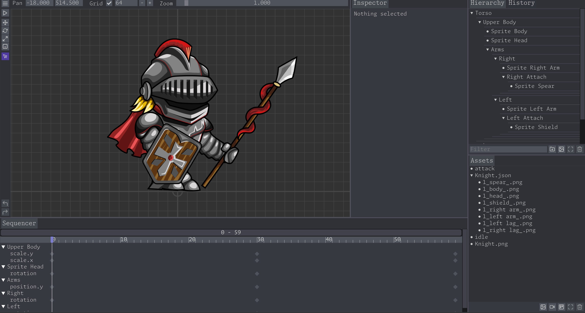

# Keyframe Studio

Keyframe Studio is a minimal 2D skeletal animation software. It's built in C++ for the web. 
 Try it at [keyframestudio.app](https://keyframestudio.app)



## V2

Whats new? Everything.

V2 is a compleate rewrite. The software now uses [sokol](https://github.com/floooh/sokol) and compiles with emscripten. The new output format is just a json file, making it easy for other applications to use these animations.

The previous is still available to use at [keyframestudio.app/v1](https://keyframestudio.app/v1), and it's source code is available on the [V1 branch](https://github.com/gszauer/KeyframeStudio/tree/v1)

## Output Format

The output json file is formatted to look like this:

```
{
	"hierarchy": [
		{
			"name": "Torso",
			"guid": "58530ba5-dad2-4a07-bc92-e663d18d13d4",
			"rtti": "TRANSFORM_NODE",
			"position": { "x": 0, "y": -156 }, 
			"rotation": 0,
			"scale": { "x": 1, "y": 1 }, 
			"children": [
				{
					"name": "Upper Body",
					"guid": "d30af3b2-b0e3-4abf-94a0-b5bef5c7581d",
					"rtti": "TRANSFORM_NODE",
					"position": { "x": 0, "y": 0 }, 
					"rotation": 0,
					"scale": { "x": 1, "y": 1 }, 
					"children": []
				}
			]
		}
	],
	"images": [
		{
			"name": "Knight.png",
			"guid": "cd633e27-6782-4a9b-8b1d-36402f2a2094",
			"rtti": "ASSET_IMAGE",
			"size": {"w": 2048, "h": 2048 },
			"data": "iVBO ... ggg=="
		} 
	],
	"atlases": [
		{
			"name": "Knight.json",
			"guid": "9aec3b1b-e9a5-4631-a666-f30a252a5bff",
			"rtti": "ASSET_ATLAS",
			"size": {"w": 2048, "h": 2048 },
			"frames": [
				{
					"name": "1_spear_.png",
					"guid": "7d7dfadf-dbdb-4fad-990a-0ac0b5b65331",
					"rtti": "ASSET_FRAME",
					"p0": { "x": 2, "y": 2},
					"uv0": { "x": 2, "y": 2},
					"p1": { "x": 137, "y": 2},
					"uv1": { "x": 1064, "y": 2},
					"p2": { "x": 137, "y": 1064},
					"uv2": { "x": 1064, "y": 137},
					"p3": { "x": 2, "y": 1064},
					"uv3": { "x": 2, "y": 137},
					"rotated": false
				},
				{
					"name": "1_body_.png",
					"guid": "69dabda5-5ad7-4382-8670-b86e397a7028",
					"rtti": "ASSET_FRAME",
					"p0": { "x": 141, "y": 2},
					"uv0": { "x": 141, "y": 2},
					"p1": { "x": 791, "y": 2},
					"uv1": { "x": 672, "y": 2},
					"p2": { "x": 791, "y": 533},
					"uv2": { "x": 672, "y": 652},
					"p3": { "x": 141, "y": 533},
					"uv3": { "x": 141, "y": 652},
					"rotated": true
				}
			]
		} 
	],
	"animations": [
		{
			"name": "attack",
			"guid": "17fe8e01-f8ed-434b-8192-d91c7b5b6be8",
			"rtti": "ASSET_ANIMATION",
			"frameRate": 30,
			"frameCount": 60,
			"looping": false,
			"tracks": [
				{
					"name": "rotation",
					"target": "d30af3b2-b0e3-4abf-94a0-b5bef5c7581d",
					"rtti": "TRACK_FLOAT",
					"frames": [
						{ "index": 0, "data": 0 } ,
						{ "index": 30, "data": 0.250293 } ,
						{ "index": 59, "data": 0 } 
					]
				}
			]
		} 
	]
}
```

At the root level is an object that always has the following arrays:

* __hierarchy__: This is the scene hierarchy. Each node has a guid, and can have children. The rtti field contains information about what kind of node is serialized, there are currently three node types supported: transform, sprite, base.
* __atlases__: An atlas is a sprite sheet. One atlas contains many frames, each frame is a square on the larger image that the atlas references. Frames can be rotated. Some additional vertex data is also recorded, but it can be ignored. 
* __images__: Any image that was imported will be included here as a base 64 string. All png files are embedded.
* __animations__: Contains animation objects. Each animation object is a collection of tracks, which effect one property of the target object. For example, the x component of the target objects position. Only linear interpolation is supported.