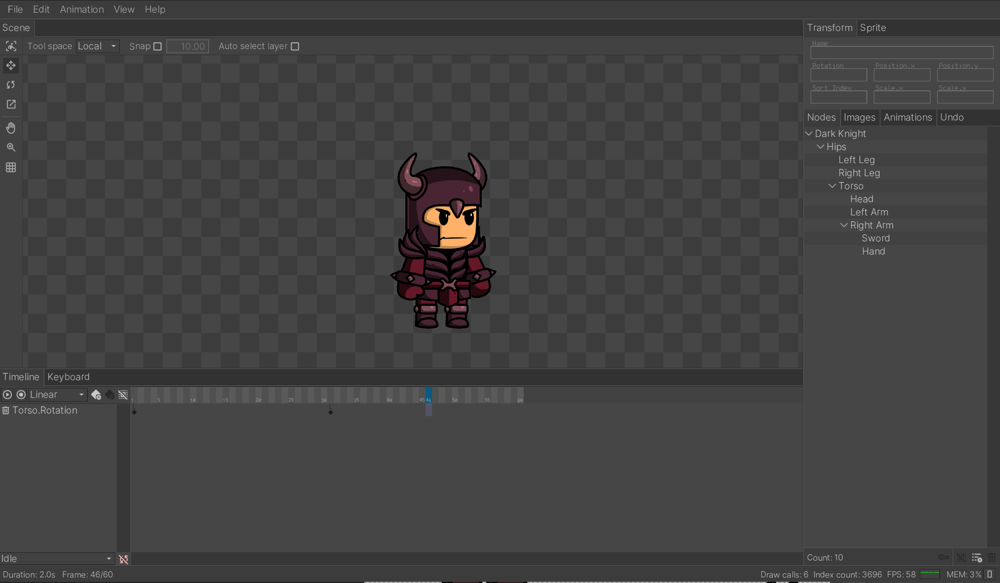

# Keyframe Studio



Keyframe Studio is a minimal 2D skeletal animation software. It's built in C++ for the web, meaning there are no dependancies on the C runtime. The project builds and runs without using emscripten. The entire UI is an IMGUI, fun dev-stats in the lower right hand corner.

## Building

Keyframe Studio needs ```clang``` and ```python``` to build. With both of these installed, just run ```build.bat```. The build results will be located in ```project_animator/build```. 

The debuggable builds use ```wasm-sourcemap.py``` to generate a source map that lets you debug in browser. This script is included in the ```project_animator/python``` directory, but ```build.bat``` expects it to be located at: ```C:/WASM/wasm-sourcemap.py```. You can edit ```build.bat``` to run it from the current directory.

## Project structure

Keyframe Studio is built on my game framework. The framework handles things like window management, input, memory allocation, etc. Here is a list of what you will find in each directory:

* ```debt``` - mostly stb libraries. This is the only external code being used.
* ```designs``` - shows what the inital plan for Keyframe Studio looked like, and how the final project shaped up.
* ```FileFormat``` - Documentation and a sample loader for ```.kfs``` files.
* ```framework``` - Platform independent code. Contains a bunch of math, and a batched 2D renderer.
* ```platform``` - Contains platform specific code. Things like allocating memory or loading files live here. 
* ```project_animator``` - The actual aniamtion software. It's not quiet the same quality as platform and framework. You can really feel the un-treated ADHD in this folder.

## Known bugs

There are a few known bugs that i didn't fix because they don't impact my workflow. But i expect others may find annoying:

* The manipulator gizmos don't respond to mouse input 1 to 1. 
* Auto select layer doesn't repsect layer order.
* Auto select layer uses only the parent nodes rotation to draw the initial outline.
* Can't import assets, or open external links on iOS (works on desktop)